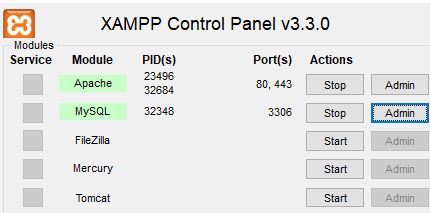
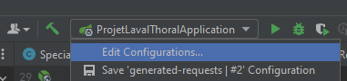
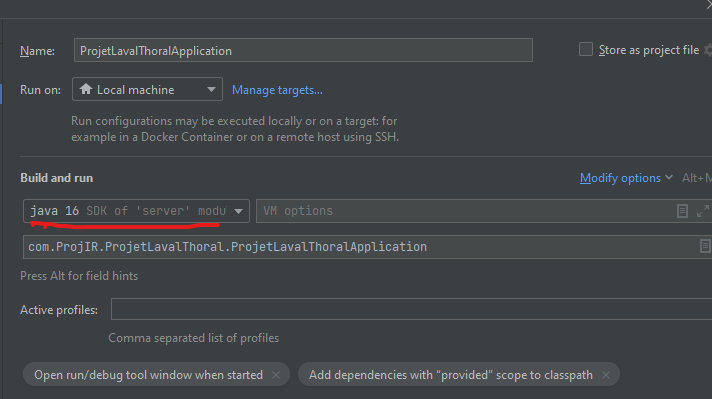
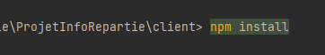
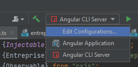
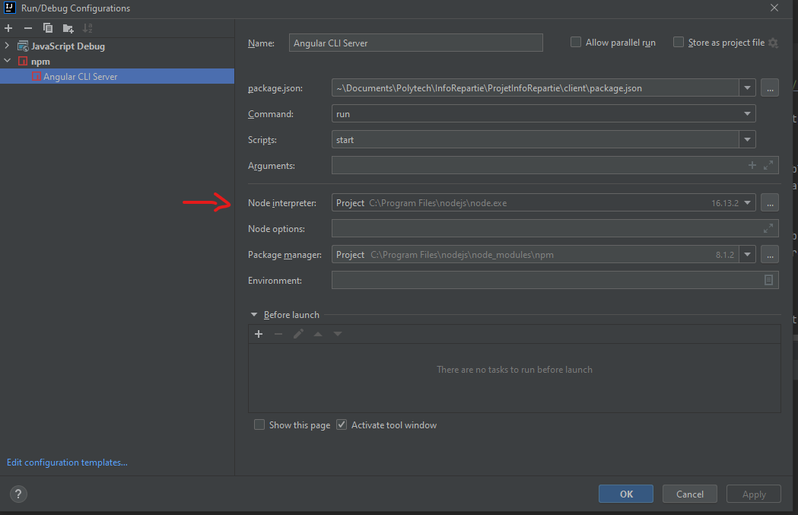
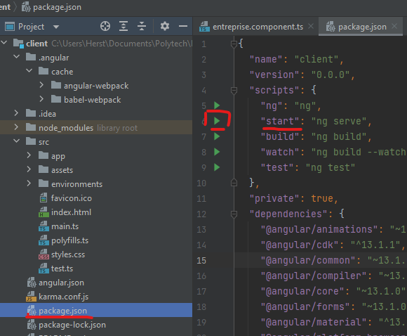

Bonjour

Pour lancer le projet rien de plus simple,

Tout d'abord avec Xampp lancez les module Apache et MySQL

Ensuite il vous ouvrir deux instances d'intellIJ, une sur le dossier "Client" et l'autre sur le dossier "Server"

Pour l'instance IntelliJ ouvert sur le dossier Server vous devez spécifier le sdk dans edit configuration (voir captures d'écran ci dessous), le projet a été construit avec Java 16
Vous pouvez ensuite le back de l'application depuis ProjetLavalThoralApplication

Pour le front, et donc la deuxieme instance d'intellIJ celle sur Client vous devez d'abord entrer la commande "npm install" dans le terminal de l'application pour installer les dépendances (il vous faudra avoir node d'installer sur votre machine)

Pour lancer le projet il suffit d'executer le bouton play dans "package.json" de la ligne "start : ng serve"

