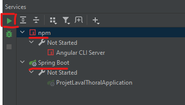

Bonjour

Pour lancer le projet rien de plus simple,

Tout d'abord avec Xampp lancez les module Apache et MySQL

Ouvrez ensuite le dossier ProjetInfoRepartie avec IntellIJ

Dans l'onglet Terminal (ALT + F12) en bas de l'application, placez vous dans le dossier client (cd client) et installez les dépendances avec "npm install"

Dans l'onglet Services (ALT + 8) en bas de l'application vous retrouvez les deux configurations pour lancer le front (npm) et le back (Spring Boot)

En premier lancez le back en séléctionnant SpringBoot et en appuyant sur le bouton play
Puis lancez le front en selectionnnant npm et en appuyant sur le bouton play

L'application est désormais accessible sur http://localhost:4200/

NB : le port par défaut utilisé par TomCat lors du lancement du back est 8080